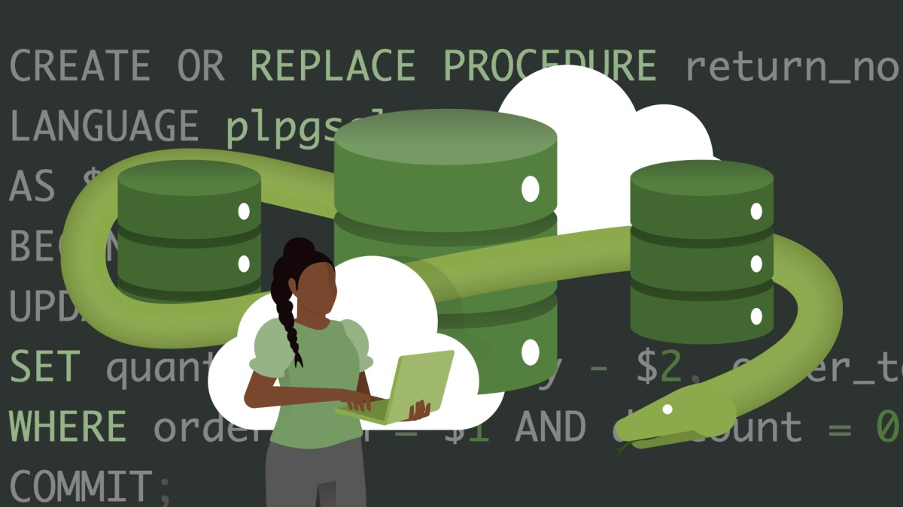

# Advanced Python: Working with Databases 🐍💾📚

### Table of Contents
1. [Course Overview](#course-overview)
2. [Course Modules](#course-modules)
3. [Progress](#progress)
4. [Running Locally](#running-locally)
5. [Credits](#credits)

## Course Overview

Advanced developers are expected to master database selections, and this course provides an excellent comparison of different types of databases that Python can interact with—SQLite, MySQL, and PostgreSQL. Taught by Kathryn Hodge, this course takes you through the essentials of setting up, querying, and optimizing databases in Python.

### Course Modules

#### Introduction to Databases in Python
- Database definition and types
- Python Database API

#### Using SQLite in Python
- Creating SQLite database
- Adding multiple records
- Filtering records
- SQLAlchemy
- SQL expression language
- Chapter Challenge

#### Using MySQL in Python
- Creating MySQL database
- Building Tables
- Inserting Data
- Connecting a Python app to MySQL
- Encapsulating database operations
- Chapter Challenge

#### Using PostgreSQL in Python
- Creating PostgreSQL database
- Building Tables
- Inserting Data
- Interacting with Postgres using Python
- Encapsulating database operations
- Chapter Challenge

## Progress

- [x] Introduction to Databases in Python
- [x] Using SQLite in Python
- [x] Using MySQL in Python
- [x] Using PostgreSQL in Python

## Running Locally

See the "Running Locally" section in the [original repo's README](https://www.linkedin.com/learning/advanced-python-working-with-databases-22307421?dApp=59033956&leis=LAA) for steps on how to run the code locally.

## Credits
 
This repository is a personal fork based on the LinkedIn Learning course 'Advanced Python: Working with Databases' by Kathryn Hodge. The original course and repository can be found [here](https://www.linkedin.com/learning/advanced-python-working-with-databases-22307421?dApp=59033956&leis=LAA).

### Original Instructor
Kathryn Hodge 
                            
Software Engineer

                            
I highly recommend checking out the full course for a deep dive into advanced Python database interactions, as well as Kathryn Hodge's other courses on [LinkedIn Learning](https://www.linkedin.com/learning/instructors/kathryn-hodge).

[lil-course-url]: https://www.linkedin.com/learning/advanced-python-working-with-databases-22307421?dApp=59033956&leis=LAA
[lil-thumbnail-url]: https://media.licdn.com/dms/image/D560DAQGxhz_OMvM_mQ/learning-public-crop_675_1200/0/1683668063867?e=2147483647&v=beta&t=frT7osblpohhLDjZqRYyklw6-Fay7Mgtr5hsv0QvLuc

